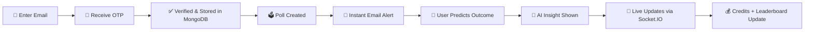

<div align="center">

# 🗳️ PollVerse.AI

### Real-time, AI-powered polling & prediction platform

Create polls · Predict outcomes · Follow live cricket · Earn credits · Climb the leaderboard 🏆


<br/>

<a href="#-getting-started"></a>
<a href="#-screenshots"></a>
<a href="#-features"></a>
<a href="#️-roadmap"></a>

</div>

---

## 📖 Table of Contents

- [Overview](#-overview)
- [Screenshots](#-screenshots)
- [Features](#-features)
  - [Polling & Predictions](#️-polling--predictions)
  - [Cricket](#-cricket)
- [Tech Stack](#-tech-stack)
- [Getting Started](#-getting-started)
- [How It Works](#-how-it-works)
- [Scripts](#-scripts)
- [Roadmap](#️-roadmap)
- [License](#-license)

---

## 🔎 Overview

**PollVerse.AI** is a real-time, AI-powered polling and prediction platform built on the MERN stack. Admins create polls, users log in via passwordless email OTP, cast predictions, and earn credits for getting it right. AI-generated insights help users make smarter predictions, while a live leaderboard keeps the competition going — across both **general polls** and **live cricket matches**.

<div align="center">

⭐ **If you like this project, consider giving it a star!** ⭐

</div>

---

## 📸 Screenshots

> All images live in the [`/screenshots`](./screenshots) folder — drop your `.png` / `.jpg` files there and they'll render automatically below.

<div align="center">

| Home / Dashboard | Live Poll Results |
|:---:|:---:|
|  |  |

| Cricket Live Match | Leaderboard |
|:---:|:---:|
|  |  |

| AI Insights | Login (OTP) |
|:---:|:---:|
|  |  |

</div>

<details>
<summary>📂 Expected screenshots folder structure</summary>

```
screenshots/
├── home.png
├── poll-results.png
├── cricket-live.png
├── leaderboard.png
├── ai-insights.png
└── login-otp.png
```

> Tip: keep screenshots under ~500KB each (PNG, 1280px wide) so the README stays fast to load.

</details>

---

## ✨ Features

### 🗳️ Polling & Predictions
- 🔐 Passwordless **email OTP login** (JWT-based)
- ⚡ Admins create polls in seconds; all verified users get **instant email alerts**
- 📡 **Live results** streamed in real time via Socket.IO — no refresh needed
- 🎯 Users **predict outcomes**, not just vote — correct predictions earn **credits**
- 🤖 **AI-powered insights** — win-probability hints and smart suggestions before you commit a prediction
- 📊 **Leaderboard & stats** — global rank, personal accuracy history, credit balance

### 🏏 Cricket
- 🔴 **Live match dashboard** with real-time score updates (runs, overs, run rate, status)
- 🏆 **Match predictions** — pick the winner, top scorer, or total runs before/during a match
- 💰 Correct cricket predictions earn the **same credits** as regular polls and count toward the **same leaderboard**
- 🔔 **Follow your favorite teams** to get notified the moment their match goes live
- 🏏 Ball-by-ball score updates pushed over the same Socket.IO channel used for poll results

---

## 🧱 Tech Stack

<div align="center">

| Layer | Technology |
|:---|:---|
| 🎨 Frontend | React, React Router, Socket.IO Client, GSAP |
| ⚙️ Backend | Express.js, Socket.IO, Mongoose, Nodemailer, JWT |
| 🗄️ Database | MongoDB |
| 🤖 AI Insights | LLM-based prediction/insight service |
| 🏏 Live Cricket Data | Third-party Cricket Score API (server-polled, broadcast via Socket.IO) |

</div>

---

## 🚀 Getting Started

```bash
# 1. Install dependencies
npm run install-all

# 2. Configure environment
cp server/.env.example server/.env
```

<details>
<summary>⚙️ <strong>.env essentials</strong> (click to expand)</summary>

```env
MONGO_URI=your_mongodb_connection_string
JWT_SECRET=your_jwt_secret

EMAIL_HOST=smtp.gmail.com
EMAIL_PORT=587
EMAIL_USER=your@gmail.com
EMAIL_PASS=your_16_char_app_password

CRICKET_API_KEY=your_cricket_api_key
CRICKET_POLL_INTERVAL=15
```

</details>

```bash
# 3. Run it
npm start
```

| Service | URL |
|---|---|
| 🎨 Frontend | http://localhost:3000 |
| ⚙️ Backend | http://localhost:5000 |

---

## ⚙️ How It Works



1. **Login** — user enters email → receives a 6-digit OTP → verified and stored in MongoDB.
2. **Poll created** — every verified user gets an email notification instantly.
3. **Predict** — users predict the poll outcome or a live cricket match result; AI insights are shown alongside each option.
4. **Live updates** — poll results and cricket scores update in real time via Socket.IO.
5. **Credits & Leaderboard** — correct predictions add credits to the user's balance, and the global leaderboard updates accordingly.

---

## 📦 Scripts

| Command | Description |
|---|---|
| `npm start` | Start frontend + backend together |
| `npm run server` | Backend only |
| `npm run client` | Frontend only |
| `npm run build` | Production build of the React client |

---

## 🗺️ Roadmap

- [ ] 🔔 Web push notifications alongside email
- [ ] 🏈 Multi-sport predictions (football, kabaddi)
- [ ] 🔥 Prediction streaks and badges
- [ ] 🌙 Dark mode

---

## 📄 License

MIT

<div align="center">

Made with ❤️ for poll & cricket fans

</div>
