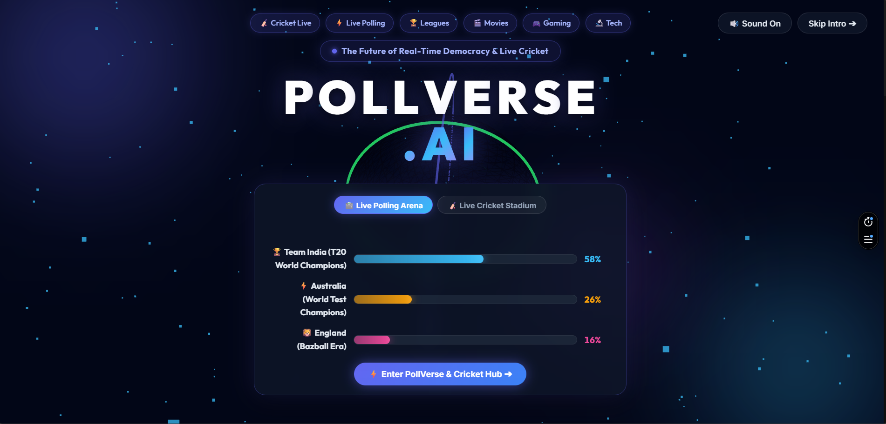
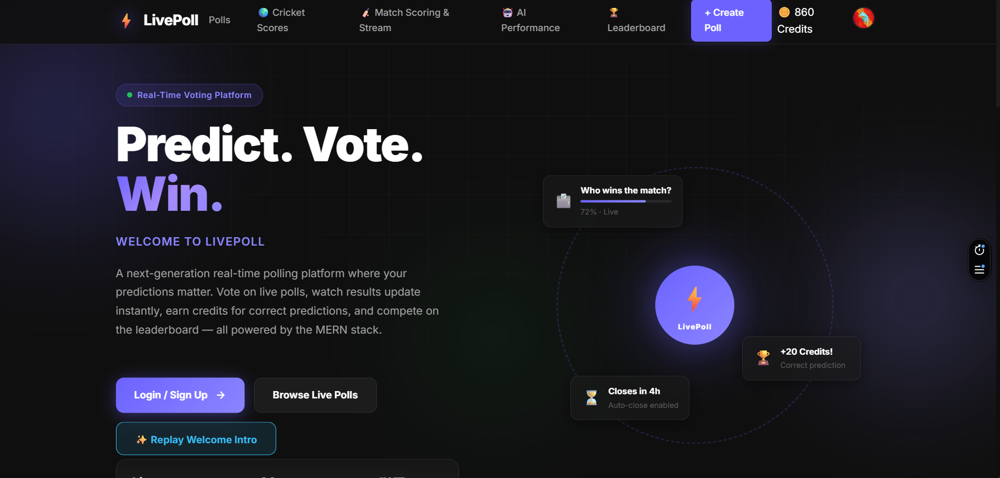
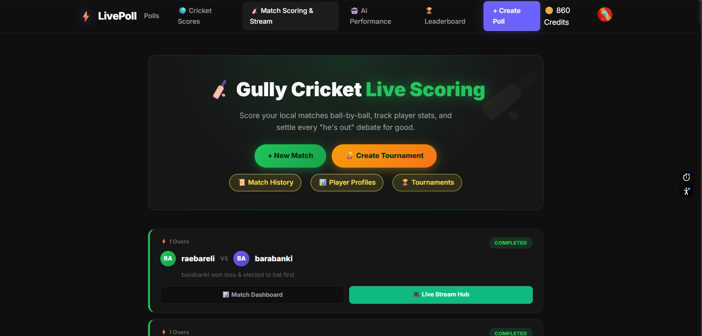
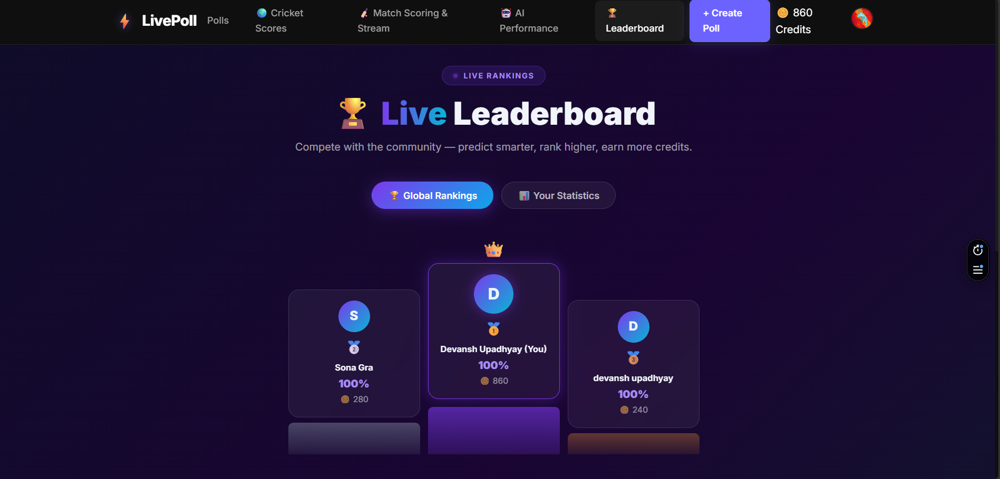
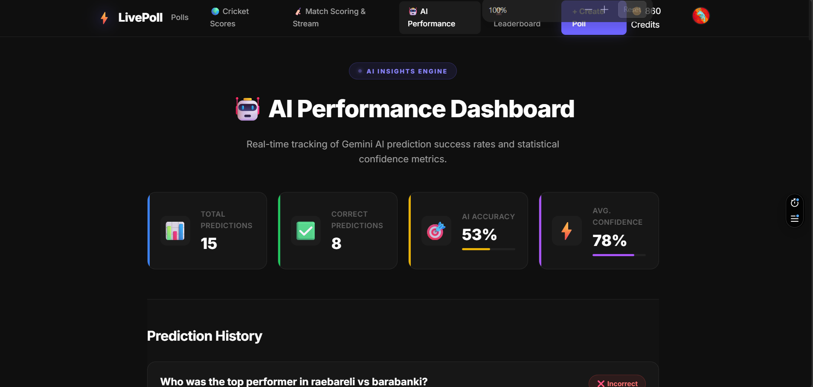
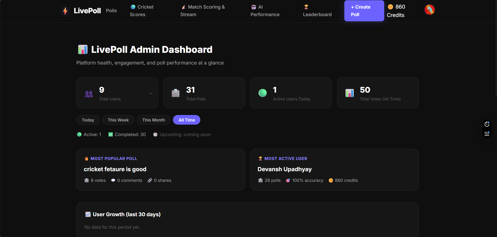
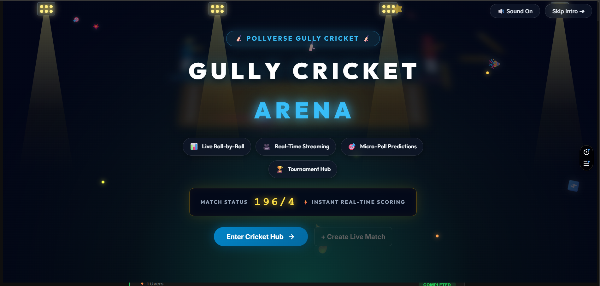
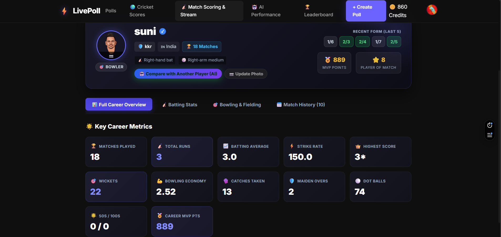
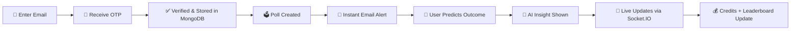

<div align="center">

# 🗳️ PollVerse.AI — Real-Time AI Polling, Prediction & Live Cricket Platform

### PollVerse: the open-source MERN stack app to create polls, predict outcomes, follow live cricket scores, earn credits & climb the leaderboard 🏆


<br/>

<a href="#-getting-started"></a>
<a href="#-screenshots"></a>
<a href="#-features"></a>
<a href="#️-roadmap"></a>

<br/><br/>


</div>

<div align="center">
  
</div>

> **🔗 Live Demo:** [_add your deployed PollVerse link here_](https://poll-verse-ai-delta.vercel.app/) &nbsp;|&nbsp; **📦 Repo:** `pollverse-ai` &nbsp;|&nbsp; **👤 Author:**  **Devansh Upadhyay**

---

## 📖 Table of Contents

- [What is PollVerse?](#-what-is-pollverse)
- [Screenshots](#-screenshots)
- [Features](#-features)
  - [Polling & Predictions](#️-polling--predictions)
  - [Cricket](#-cricket)
- [Why PollVerse.AI?](#-why-pollverseai)
- [Use Cases](#-use-cases)
- [Tech Stack](#-tech-stack)
- [Cloud Technologies](#️-cloud-technologies)
- [Getting Started](#-getting-started)
- [How It Works](#-how-it-works)
- [Scripts](#-scripts)
- [FAQ](#-faq)
- [Roadmap](#️-roadmap)
- [Contributing](#-contributing)
- [License](#-license)

---

## 🔎 What is PollVerse?

**PollVerse.AI** (also written as **PollVerse**) is a real-time, AI-powered **online polling and prediction platform** built on the **MERN stack** (MongoDB, Express.js, React, Node.js). Admins create polls, users log in via **passwordless email OTP**, cast predictions, and earn credits for getting it right. AI-generated insights help users make smarter predictions, while a **live leaderboard** keeps the competition going — across both **general polls** and **live cricket matches**.

If you are looking for a **real-time polling app**, a **prediction game with leaderboard**, a **live cricket score and prediction app**, or a **Socket.IO + React + MongoDB project** to learn from or fork, PollVerse.AI is built for exactly that.

<div align="center">

⭐ **If you like this project, consider giving it a star!** ⭐

</div>

---

## 📸 Screenshots

> All images live in the [`/screensorts`](./screensorts) folder — drop your `.png` / `.jpg` files there and they'll render automatically below.

<div align="center">

| Home / Dashboard | Live Poll Results |
|:---:|:---:|
|  |  |

| Cricket Live Match | Leaderboard |
|:---:|:---:|
|  |  |

| AI Insights | Admin |
|:---:|:---:|
|  |  |

| Cricket Intro | Players Profile |
|:---:|:---:|
|  |  |

</div>

<details>
<summary>📂 Expected screenshots folder structure</summary>

```
screensorts/
├── Prointro.png
├── PollSection.png
├── CrickINterface.png
├── Leaderbord.png
├── AIInsight.png
├── Admin.png
├── CrickIntro.png
└── playerProfile.png
```

> Tip: keep screenshots under ~500KB each (PNG, 1280px wide) so the README stays fast to load.

</details>

---

## ✨ Features

### 🗳️ Polling & Predictions
- 🔐 Passwordless **email OTP login** (JWT-based)
- ⚡ Admins create polls in seconds; all verified users get **instant email alerts**
- 📡 **Live results** streamed in real time via Socket.IO — no refresh needed
- 🎯 Users **predict outcomes**, not just vote — correct predictions earn **credits**
- 🤖 **AI-powered insights** — win-probability hints and smart suggestions before you commit a prediction
- 📊 **Leaderboard & stats** — global rank, personal accuracy history, credit balance

### 🏏 Cricket
- 🔴 **Live match dashboard** with real-time score updates (runs, overs, run rate, status)
- 🏆 **Match predictions** — pick the winner, top scorer, or total runs before/during a match
- 💰 Correct cricket predictions earn the **same credits** as regular polls and count toward the **same leaderboard**
- 🔔 **Follow your favorite teams** to get notified the moment their match goes live
- 🏏 Ball-by-ball score updates pushed over the same Socket.IO channel used for poll results

---

## 💡 Why PollVerse.AI?

- **Prediction, not just voting** — most polling tools only count votes; PollVerse rewards you for being right.
- **Truly real-time** — Socket.IO pushes poll results and cricket scores instantly, with no page refresh.
- **AI-assisted decisions** — LLM-based insights show win-probability hints before you predict.
- **One leaderboard for everything** — general polls and live cricket share the same credits and rankings.
- **No passwords** — quick and secure email OTP login.
- **Scalable cloud setup** — AWS EC2, DynamoDB, S3 and MongoDB Atlas work together for low latency.

---

## 🎯 Use Cases

- Run a **live opinion poll** for friends, communities, colleges or events
- Play a **cricket match prediction game** during IPL, World Cup or any live series
- Build a **prediction leaderboard** for office, classroom or fan groups
- Learn how to build a **real-time app with React, Node.js, Express, MongoDB and Socket.IO**
- Use it as a **starter project** for a polling, voting or fantasy-style prediction platform

---

## 🧱 Tech Stack

<div align="center">

| Layer | Technology |
|:---|:---|
| 🎨 Frontend | React, React Router, Socket.IO Client, GSAP |
| ⚙️ Backend | Express.js, Socket.IO, Mongoose, Nodemailer, JWT |
| 🗄️ Database | MongoDB (Atlas) + DynamoDB |
| 🤖 AI Insights | LLM-based prediction/insight service |
| 🏏 Live Cricket Data | Third-party Cricket Score API (server-polled, broadcast via Socket.IO) |

</div>

---

## ☁️ Cloud Technologies

<div align="center">


</div>

| Cloud Service | Purpose |
|:---|:---|
| 🖥️ **AWS EC2** | Virtual machine instance hosting the Node.js/Express backend & Socket.IO server |
| ⚡ **DynamoDB** | NoSQL cloud database, connected alongside MongoDB for high-speed reads (leaderboard/session data) |
| ☁️ **MongoDB Atlas** | Primary cloud database for polls, predictions, users & core app data |
| 🖼️ **Amazon S3** | Cloud object storage for uploaded images & poll assets |
| 🖼️ **Cloudinary** | Media storage/delivery & on-the-fly image transformations |
| 🔄 **GitHub Actions** | CI/CD pipeline — auto build & deploy to EC2 on every push |

> 💡 The backend runs on an **AWS EC2** instance, with **DynamoDB** running alongside **MongoDB Atlas** for fast, low-latency lookups (leaderboard & session caching), while all poll/screenshot images are stored in **Amazon S3**. This hybrid cloud setup keeps PollVerse.AI fast and horizontally scalable — even during a cricket match final over!

---

## 🚀 Getting Started

**Prerequisites:** Node.js 18+, a MongoDB Atlas connection string, an SMTP email account (for OTP), and a cricket score API key.

```bash
# 0. Clone the repository
git clone https://github.com/your-username/pollverse-ai.git
cd pollverse-ai

# 1. Install dependencies
npm run install-all

# 2. Configure environment
cp server/.env.example server/.env
```

<details>
<summary>⚙️ <strong>.env essentials</strong> (click to expand)</summary>

```env
MONGO_URI=your_mongodb_connection_string
JWT_SECRET=your_jwt_secret

EMAIL_HOST=smtp.gmail.com
EMAIL_PORT=587
EMAIL_USER=your@gmail.com
EMAIL_PASS=your_16_char_app_password

CRICKET_API_KEY=your_cricket_api_key
CRICKET_POLL_INTERVAL=15

# AWS
AWS_REGION=your_aws_region
AWS_ACCESS_KEY_ID=your_aws_access_key
AWS_SECRET_ACCESS_KEY=your_aws_secret_key
DYNAMODB_TABLE_NAME=your_dynamodb_table
S3_BUCKET_NAME=your_s3_bucket_name
```

</details>

```bash
# 3. Run it
npm start
```

| Service | URL |
|---|---|
| 🎨 Frontend | http://localhost:3000 |
| ⚙️ Backend | http://localhost:5000 |

---

## ⚙️ How It Works



1. **Login** — user enters email → receives a 6-digit OTP → verified and stored in MongoDB.
2. **Poll created** — every verified user gets an email notification instantly.
3. **Predict** — users predict the poll outcome or a live cricket match result; AI insights are shown alongside each option.
4. **Live updates** — poll results and cricket scores update in real time via Socket.IO.
5. **Credits & Leaderboard** — correct predictions add credits to the user's balance, and the global leaderboard updates accordingly.

---

## 📦 Scripts

| Command | Description |
|---|---|
| `npm start` | Start frontend + backend together |
| `npm run server` | Backend only |
| `npm run client` | Frontend only |
| `npm run build` | Production build of the React client |

---

## ❓ FAQ

**What is PollVerse.AI?**
PollVerse.AI is an open-source, real-time polling and prediction platform built with React, Node.js, Express, MongoDB and Socket.IO, with AI insights and live cricket score predictions.

**How does login work in PollVerse?**
PollVerse uses passwordless email OTP login. You enter your email, receive a 6-digit OTP, and get a JWT-based session once verified.

**How do I earn credits on PollVerse?**
You earn credits by making correct predictions on polls or live cricket matches. Credits count toward the global leaderboard.

**Does PollVerse support live cricket scores?**
Yes. The server polls a third-party cricket score API and broadcasts live updates (runs, overs, run rate, status) to all users through Socket.IO.

**Is PollVerse free and open source?**
Yes, it is released under the MIT License. You can fork, modify and use it in your own projects.

**Which technologies does PollVerse use?**
React, React Router, GSAP, Express.js, Socket.IO, Mongoose, Nodemailer, JWT, MongoDB Atlas, DynamoDB, AWS EC2, Amazon S3, Cloudinary and GitHub Actions.

---

## 🗺️ Roadmap

- [ ] 🔔 Web push notifications alongside email
- [ ] 🏈 Multi-sport predictions (football, kabaddi)
- [ ] 🔥 Prediction streaks and badges
- [ ] 🌙 Dark mode

---

## 🤝 Contributing

Contributions are welcome! To contribute to PollVerse.AI:

1. Fork the repository
2. Create your feature branch: `git checkout -b feature/your-feature`
3. Commit your changes: `git commit -m "Add your feature"`
4. Push to the branch: `git push origin feature/your-feature`
5. Open a Pull Request

---

## 📄 License

MIT

---

## 🔑 Topics

`pollverse` · `pollverse-ai` · `polling-app` · `online-poll-maker` · `prediction-platform` · `real-time-polling` · `cricket-prediction` · `live-cricket-score` · `mern-stack` · `react` · `nodejs` · `express` · `mongodb` · `socket-io` · `websockets` · `ai-insights` · `leaderboard` · `otp-authentication` · `aws-ec2` · `dynamodb`

---

## 💖 Show Some Love

<div align="center">

If you like this project, **star the repo** — it really helps! ⭐

<a href="../../stargazers">
  
</a>
&nbsp;
<a href="../../network/members">
  
</a>
&nbsp;
<a href="../../watchers">
  
</a>

<br/><br/>


<br/><br/>


</div>

<div align="center">
  
</div>

<div align="center">

Made with ❤️ for poll & cricket fans

</div>
